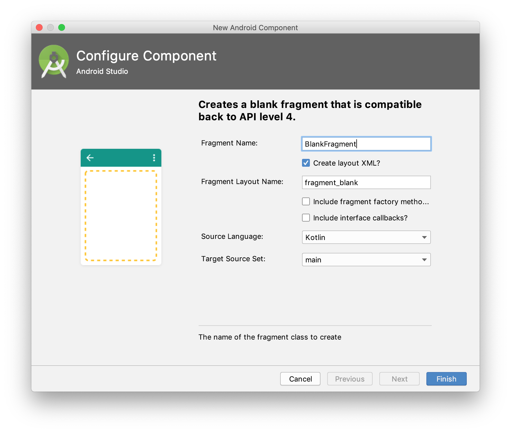

# Activities with Fragments

Fragments are, as Activities, code with some layout attached.
A fragment has to live inside an activity,
but the same definition can be used in several activities.

When you create a fragment you are asked if you want to create an XML layout,
good idea.
You can also include factory methods and interface callbacks,
wait with that.



Change the name to something useful.

## Static fragments

When you are developing apps
that work in different contexts,
as landscape and portrait mode,
it is convenient to reuse not only the code,
but also the layout.

After running the wizard and cleaning the code up a bit we have:

```kotlin
package dk.cphbusiness.applicationwithfragments

import android.os.Bundle
import android.support.v4.app.Fragment
import android.view.LayoutInflater
import android.view.ViewGroup


class FirstFragment : Fragment() {

  override fun onCreateView(
      inflater: LayoutInflater,
      container: ViewGroup?,
      savedInstanceState: Bundle?
      ) = inflater.inflate(R.layout.fragment_first, container, false)

  }
```

and

```xml
<?xml version="1.0" encoding="utf-8"?>
<FrameLayout xmlns:android="http://schemas.android.com/apk/res/android"
             xmlns:tools="http://schemas.android.com/tools"
             android:layout_width="match_parent"
             android:layout_height="match_parent"
             tools:context=".FirstFragment">

    <TextView
            android:id="@+id/first_label"
            android:text="@string/first_text"
            android:textAlignment="center"
            android:textSize="40pt"
            android:layout_width="match_parent"
            android:layout_height="match_parent"
            />

</FrameLayout>
```

for each fragment.

To reuse them in the two `activity_static_fragments` layout files
(one for each orientation)
we just have to write (for portrait):

```xml
<?xml version="1.0" encoding="utf-8"?>
<LinearLayout
        xmlns:android="http://schemas.android.com/apk/res/android"
        xmlns:tools="http://schemas.android.com/tools"
        android:orientation="vertical"
        android:layout_width="fill_parent"
        android:layout_height="fill_parent"
        tools:context=".StaticFragmentsActivity"
        >
    <fragment
            android:id="@+id/first_fragment"
            android:name="dk.cphbusiness.applicationwithfragments.FirstFragment"
            android:layout_width="fill_parent"
            android:layout_height="0dp"
            android:layout_weight="1"
            />
    <fragment
            android:id="@+id/second_fragment"
            android:name="dk.cphbusiness.applicationwithfragments.SecondFragment"
            android:layout_width="fill_parent"
            android:layout_height="0dp"
            android:layout_weight="1"
            />
    <TextView
            android:id="@+id/textView"
            android:text="@string/go_landscape_text"
            android:textAlignment="center"
            android:layout_width="fill_parent"
            android:layout_height="wrap_content"
            />
</LinearLayout>
```

and (for landscape):

```xml
<?xml version="1.0" encoding="utf-8"?>
<LinearLayout
        xmlns:android="http://schemas.android.com/apk/res/android"
        xmlns:tools="http://schemas.android.com/tools"
        android:orientation="vertical"
        android:layout_width="fill_parent"
        android:layout_height="fill_parent"
        tools:context=".StaticFragmentsActivity"
        >
    <LinearLayout
            android:layout_width="match_parent"
            android:layout_height="0dp"
            android:layout_weight="1"
            >
        <fragment
                android:id="@+id/first_fragment"
                android:name="dk.cphbusiness.applicationwithfragments.FirstFragment"
                android:layout_height="match_parent"
                android:layout_width="0dp"
                android:layout_weight="1"
        />
        <fragment
                android:id="@+id/second_fragment"
                android:name="dk.cphbusiness.applicationwithfragments.SecondFragment"
                android:layout_height="match_parent"
                android:layout_width="0dp"
                android:layout_weight="1"
        />
    </LinearLayout>
    <TextView
            android:id="@+id/textView"
            android:text="@string/go_landscape_text"
            android:textAlignment="center"
            android:layout_width="fill_parent"
            android:layout_height="wrap_content"
    />
</LinearLayout>
```

I have used `LinearLayout`s for less xml in the example,
but `ConstraintLayout`s works fine as well.

## Dynamic Fragments

